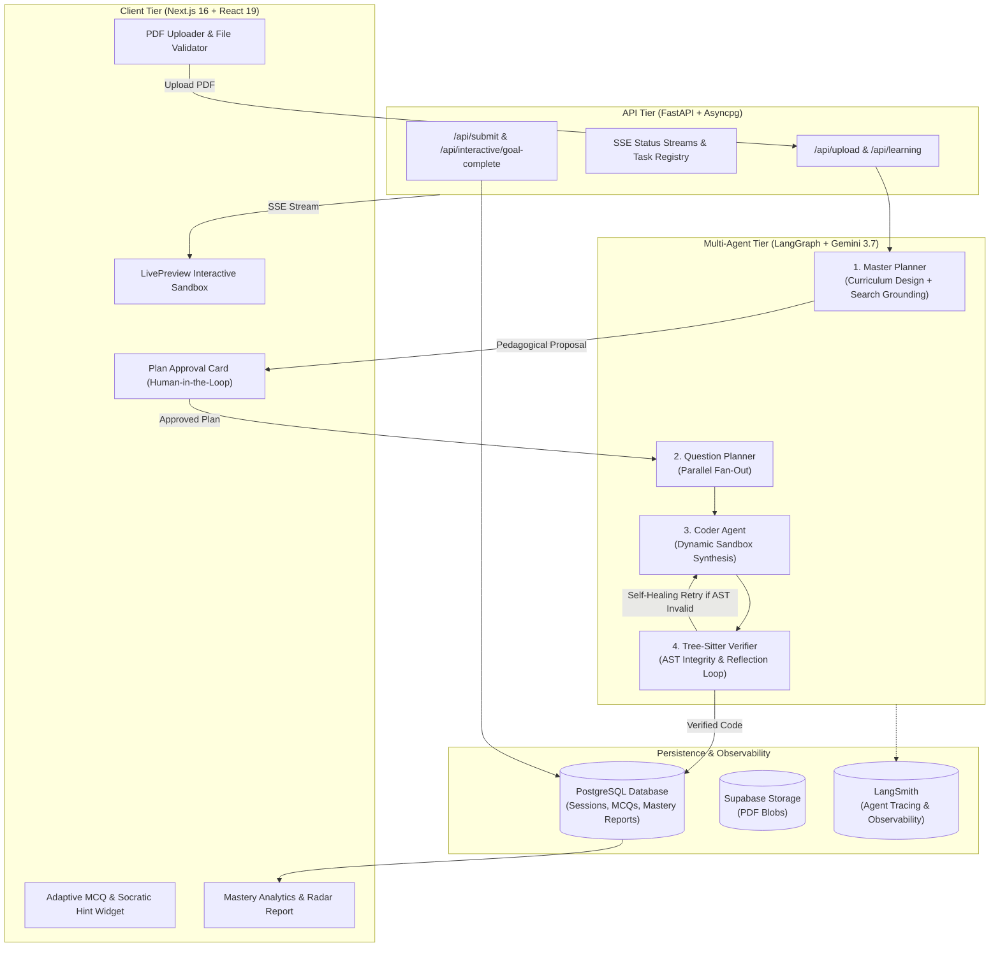

# 🔄 QuizLoop

<div align="center">

### **Human-In-The-Loop AI Quiz & Pedagogical Assessment Engine**

Transform raw technical documents, textbooks, and research papers into rigorous quizzes, human-in-the-loop verified curricula, and real-time interactive simulation sandboxes.

[](https://nextjs.org/)
[](https://react.dev/)
[](https://fastapi.tiangolo.com/)
[](https://python.org/)
[](https://ai.google.dev/)
[](https://github.com/langchain-ai/langgraph)
[](https://www.postgresql.org/)

[Features](#-key-features) • [Architecture](#-system-architecture) • [Getting Started](#-quick-start) • [Documentation](#-documentation)

---

</div>

## 🌟 Key Features

- 📄 **Document-to-Assessment Ingestion**: Upload dense research papers, syllabi, or lecture PDFs ($\le 25\text{MB}$) with automatic token-aware context caching.
- 🧑‍🏫 **Human-in-the-Loop (HITL) Curriculum Approval**: The AI Master Planner proposes a structured pedagogical lesson plan; educators and students can inspect, customize, request adjustments, or approve before generation begins.
- 🧪 **Interactive Simulation Playgrounds**: Generates single-file dynamic React simulations (`App.js`) featuring real-time sliders, physics engines, and canvas visualizations with goal-threshold verification.
- 🛡️ **Tree-sitter AST & Self-Healing Reflection**: Native C bindings inspect generated React code for syntax integrity and module whitelists, triggering automated corrective retries before reaching the student.
- 📊 **Dynamic Mastery Reporting**: Generates Bloom's taxonomy analytics, mastery gauges, weak-spot diagnostics, and personalized reinforcement plans.
- ⚡ **Low-Latency Streaming**: Asynchronous event streams (SSE) deliver instant phase-by-phase updates and live feedback.

---

## 🏛️ System Architecture



---

## 🚀 Quick Start

### Prerequisites
- **Node.js** 20+ & **pnpm** (or npm/yarn)
- **Python** 3.12+ (Python 3.13 recommended)
- **PostgreSQL** 15+ database instance
- **Google Gemini API Key** (`gemini-3.7-flash`)

### 1. Backend Setup

```bash
# Navigate to backend
cd backend

# Create virtual environment
python -m venv venv
# On Windows:
.\venv\Scripts\activate
# On macOS/Linux:
source venv/bin/activate

# Install dependencies
pip install -r requirements.txt

# Configure environment
cp .env.example .env
# Edit .env with your GEMINI_API_KEY and DATABASE_URL

# Start FastAPI server
uvicorn app.main:app --reload --port 8000
```

### 2. Frontend Setup

```bash
# In the project root directory
npm install

# Run Next.js development server
npm run dev
```

Open [http://localhost:3000](http://localhost:3000) in your browser.

---

## 🧭 Documentation Hub

For in-depth guides and technical specifications, explore the [`docs/`](docs/) directory:

| Guide | Summary |
| :--- | :--- |
| **[System Architecture](docs/ARCHITECTURE.md)** | Deep dive into client, backend, streaming, and execution sandbox models. |
| **[AI Agent Pipeline](docs/AI_AGENT_PIPELINE.md)** | LangGraph state machine, AST validation, dynamic thinking budgets, and reflection loops. |
| **[API Reference](docs/API_REFERENCE.md)** | Complete REST and Server-Sent Event (SSE) endpoint contracts. |
| **[Database Schema](docs/DATABASE_SCHEMA.md)** | PostgreSQL relational DDL, constraints, composite indexes, and data integrity. |
| **[Getting Started & Ops](docs/GETTING_STARTED.md)** | Environment variables, local testing, migrations, and operational guidelines. |

---

## 🧪 Testing

```bash
# Run backend test suite
cd backend
pytest tests/ -v

# Run API contract & validation tests
pytest tests/test_api_contracts.py -v
```

---

## 📄 License

This project is licensed under the MIT License.
