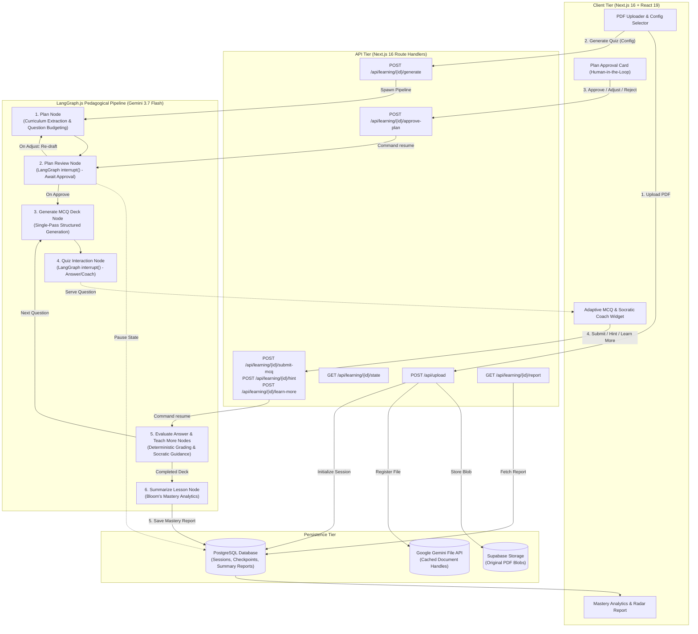

# QuizLoop

<div align="center">

### Human-In-The-Loop AI Assessment and Pedagogical Learning Engine

Transform technical documents, research publications, and textbooks into structured curricula, human-curated lesson plans, adaptive quizzes with Socratic coaching, and comprehensive mastery analytics.

[](https://nextjs.org/)
[](https://react.dev/)
[](https://typescriptlang.org/)
[](https://nodejs.org/)
[](https://ai.google.dev/)
[](https://github.com/langchain-ai/langgraphjs)
[](https://www.postgresql.org/)

[Key Features](#key-features) • [System Architecture](#system-architecture) • [Pedagogical Flow](#pedagogical-pipeline-flow) • [Quick Start](#quick-start) • [Documentation Hub](#documentation-hub) • [Testing](#testing)

---

</div>

## Key Features

- **Document Ingestion with Context Caching**: Ingest dense research papers, syllabi, and technical PDFs ($\le 25\text{MB}$) via the Google Gemini File API with token-aware context caching for reduced latency and token efficiency.
- **Human-in-the-Loop (HITL) Curriculum Approval**: The AI Master Planner drafts a structured pedagogical curriculum; educators and learners inspect learning objectives, customize topic allocations, request prompt adjustments, or approve before question generation begins.
- **Single-Pass Deck Synthesis**: Pre-generates the entire assessment deck in a single structured Gemini 3.7 call to ensure topic coherence, zero runtime latency per question, and strict answer-key isolation.
- **Interactive Socratic Coaching**: Delivers scenario-based questions with multi-tier progressive hints and grounded on-demand conceptual explanations without spoiling answers.
- **Comprehensive Mastery Reporting**: Produces Bloom's taxonomy analytics, objective-by-objective proficiency scores, strength and growth diagnostics, and personalized remediation reading plans.
- **Stateful Resilience with LangGraph Checkpoints**: Built on LangGraph 1.x with PostgreSQL checkpointers and thread isolation, allowing paused human interrupts and seamless state resumption across network reconnects.

---

## System Architecture



---

## Pedagogical Pipeline Flow

The platform executes a 5-stage lifecycle designed for high pedagogical rigor and transparency:

```
[ PDF Upload ] ──> [ Plan Draft ] ──> [ HITL Review ] ──> [ MCQ & Socratic Coach ] ──> [ Mastery Report ]
                           │                  │
                           └─ <Re-Draft Loop> ┘
```

1. **PDF Ingestion**: The student or educator uploads a document and sets question count (3 to 10) and difficulty.
2. **Curriculum Planning**: Gemini 3.7 analyzes the document structure and extracts 3 to 5 core learning objectives with proportional question weights.
3. **HITL Review & Refinement**: The user inspects the proposed syllabus. Rejection or feedback triggers an automated re-drafting loop (up to 3 revisions before fallback).
4. **Assessment & Socratic Tutoring**: The student steps through the question deck. Instant evaluation provides deterministic feedback without LLM lag, while Socratic hints and "Ask the Coach" explanations offer grounded guidance.
5. **Mastery Analytics**: The session concludes with a detailed breakdown of cognitive performance across Bloom's levels, highlighting specific concepts mastered and targeted areas for improvement.

---

## Quick Start

### Prerequisites
- **Node.js** 20+ and **npm** (or pnpm/yarn)
- **PostgreSQL** 15+ database instance (Supabase, Neon, or local)
- **Google Gemini API Key** (`gemini-3.7-flash`)

### Setup

```bash
# 1. Install dependencies (single codebase — frontend + API in one Next.js app)
npm install

# 2. Configure environment variables
cp .env.example .env
# Edit .env with your GEMINI_API_KEY and POSTGRES_URL

# 3. Apply the database schema
npm run db:migrate

# 4. Start the Next.js development server (API + frontend)
npm run dev
```

Open [http://localhost:3000](http://localhost:3000) in your browser. The API runs on the same origin under `/api/*`.

---

## Documentation Hub

Detailed architecture specifications and technical references are available in the [`docs/`](docs/) directory:

| Document | Description |
| :--- | :--- |
| **[System Architecture](docs/ARCHITECTURE.md)** | Next.js API tier, LangGraph.js state machine, PostgreSQL persistence, and storage design. |
| **[AI Agent Pipeline](docs/AI_AGENT_PIPELINE.md)** | Pedagogical StateGraph, node responsibilities, HITL interrupt/resume semantics, and reflection rules. |
| **[API Reference](docs/API_REFERENCE.md)** | Complete REST contracts for PDF upload, state polling, plan approval, quiz execution, and mastery reporting. |
| **[Database Schema](docs/DATABASE_SCHEMA.md)** | PostgreSQL relational DDL, session state schemas, summary reports, and migrations. |
| **[Getting Started and Operations](docs/GETTING_STARTED.md)** | Environment variables, local setup instructions, test suites, and operational troubleshooting. |
| **[Migration Ledger](docs/BACKEND_TS_MIGRATION_LEDGER.md)** | Historical record of the Python → TypeScript backend migration. |

---

## Testing

```bash
# Run the full test suite (server + frontend component tests)
npm test

# Type-check the entire codebase
npx tsc --noEmit
```

---

## License

This project is licensed under the MIT License.
