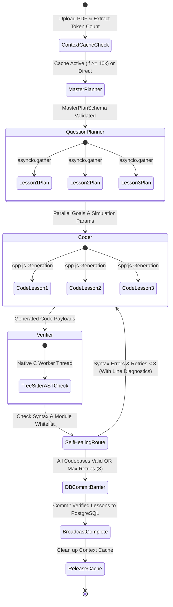

# 🤖 Multi-Agent AI Pipeline & LangGraph Architecture

## 1. Multi-Agent StateGraph Architecture

The interactive simulation curriculum is orchestrated as an asynchronous, cyclic **LangGraph** multi-agent graph:

---

## 2. Pipeline Stages & Node Breakdown

### Stage 0: Dynamic Context Cache Manager ([`cache_manager.py`](file:///g:/Stuff/Study/Programs/QuizLoop-Interactive-AI-Quiz-Assessment-Platform/backend/app/services/cache_manager.py))
- **Trigger**: Document size $\ge 10,000$ tokens.
- **Action**: Provisions an explicit `cachedContents` object via `client.caches.create` with a 10-minute TTL (`600s`).
- **Benefit**: Reused across Master Planner and 3 parallel Question Planner passes, cutting prompt token costs by **$75\%$**.

---

### Stage 1: Master Planner Node ([`master_planner.py`](file:///g:/Stuff/Study/Programs/QuizLoop-Interactive-AI-Quiz-Assessment-Platform/backend/app/agents/interactive_graph/nodes/master_planner.py))
- **Role**: Educational curriculum architect.
- **Model**: `gemini-3.7-flash` with `thinking_budget=4096` (High Thinking) and **Selective Google Search Grounding**.
- **Prompt Objective**: Analyze the technical document and extract 3 to 5 physical, mathematical, or visual simulation playgrounds where students manipulate variables to observe dynamic system feedback.
- **Output Schema**: `MasterPlanSchema` (`lessons: [{ title, concept, description }]`).

---

### Stage 2: Question Planner Node ([`question_planner.py`](file:///g:/Stuff/Study/Programs/QuizLoop-Interactive-AI-Quiz-Assessment-Platform/backend/app/agents/interactive_graph/nodes/question_planner.py))
- **Role**: Virtual lab experiment designer.
- **Model**: `gemini-3.7-flash` with `thinking_budget=2048` (Medium Thinking).
- **Parallelism**: Executes parallel sub-tasks across all master plan lessons using `asyncio.gather`.
- **State Aggregation**: Uses LangGraph's `Annotated[List[DetailedQuestionPlan], operator.add]` reducer to merge parallel results without state collisions.
- **Prompt Objective**: For each lesson, define 2–3 **actionable, threshold-based goals** using active verbs ("Increase", "Reach", "Stabilize") and controllable variable specifications (min, max, default, unit).

---

### Stage 3: Coder Node ([`coder.py`](file:///g:/Stuff/Study/Programs/QuizLoop-Interactive-AI-Quiz-Assessment-Platform/backend/app/agents/interactive_graph/nodes/coder.py))
- **Role**: React simulation engineer.
- **Model**: `gemini-3.7-flash` with `thinking_budget=1024` (Low Thinking to maximize the 16,384 output token budget).
- **Strict UI Contract**:
  - Root: `flex h-screen w-full bg-[#0B0F1A] text-slate-100 overflow-hidden font-sans`
  - Left Panel: `w-[260px]` configuration sidebar with sliders and real-time badges.
  - Right Viewport: Full-screen responsive SVG / HTML Canvas with `viewBox="0 0 1000 700"`.
  - Goal Dispatch: Wrapped with a `useRef({})` guard to ensure `completeGoal(index)` fires **exactly once** upon threshold transition.
- **Output Schema**: `CodeGenerationSchema` (`files: {"/App.js": "..."}, dependencies: {"framer-motion": "latest", "lucide-react": "latest"}`).

---

### Stage 4: Verifier Node & Tree-Sitter AST Engine ([`verifier.py`](file:///g:/Stuff/Study/Programs/QuizLoop-Interactive-AI-Quiz-Assessment-Platform/backend/app/agents/interactive_graph/nodes/verifier.py))
- **Role**: Static code analysis and contract auditor.
- **Mechanism**: Parses generated JSX using native C bindings in `tree-sitter-javascript` inside a worker thread (`asyncio.to_thread`) to prevent event-loop blocking.
- **Audits**:
  1. `root_node.has_error`: Traps missing braces, unclosed JSX tags, and syntax anomalies with exact line and column coordinates.
  2. *Module Whitelist*: Ensures only approved modules (`react`, `framer-motion`, `lucide-react`) are referenced.
  3. *Export Contract*: Confirms component definition `function App() { ... }` and `renderComponent(App)`.

---

### Stage 5: Self-Healing Reflection Loop
- If any codebase fails AST verification, the conditional edge `check_verification_status` intercepts the failure:
  - Bounded Retries: Capped at `retry_count < 3` and graph `recursion_limit = 12`.
  - Feedback Injection: Re-prompts the Coder node with the exact syntax error line diagnostics.
  - Resilience: Once verified (or max retries reached), proceeds to the write-barrier.

---

## 3. Gemini 3.7 Thinking Budgets & Grounding Configuration

| Pipeline Stage | Model | Thinking Budget | Google Search Grounding | Output Tokens |
| :--- | :--- | :--- | :--- | :--- |
| **Standard Quiz Generator** | `gemini-3.7-flash` | `2,048` | **Enabled** | `16,384` |
| **1. Master Planner** | `gemini-3.7-flash` | `4,096` (High) | **Enabled** | `16,384` |
| **2. Question Planner** | `gemini-3.7-flash` | `2,048` (Medium) | Disabled | `16,384` |
| **3. Coder Node** | `gemini-3.7-flash` | `1,024` (Low) | Disabled | `16,384` |
| **4. Verifier Node** | Native C / Tree-sitter | *N/A (Local)* | *N/A* | *N/A* |

---

## 4. Observability & LangSmith Tracing

All LLM calls and LangGraph graph executions are instrumented with `@traceable`:
- **LangSmith Tracing**: Captures complete invocation trees, latency breakdowns, and system instructions.
- **Token Auditing**: Token metrics (`prompt_tokens`, `thought_tokens`, `output_tokens`, `total_tokens`) are recorded in PostgreSQL `sessions` and `token_usage_logs` asynchronously on every call.
