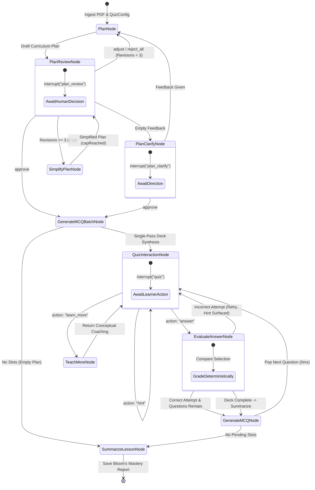

# Multi-Agent AI Pipeline and LangGraph Architecture

## 1. Pedagogical StateGraph Architecture

The entire assessment lifecycle is orchestrated via an asynchronous, cyclic **LangGraph.js 1.x** StateGraph (`@langchain/langgraph`), compiled with a durable `PostgresSaver` checkpointer in production and `MemorySaver` in tests:

---

## 2. Pipeline Stages and Node Specifications

### Stage 1: Plan Node (`plan_node`)
- **Role**: Educational curriculum architect.
- **Model**: `gemini-3.7-flash` with structured schema enforcement (`PlanArraySchema`).
- **Objective**: Analyze the technical document and extract **3 to `min(totalQuestions, 6)`** core learning objectives. Deterministically allocate question budgets across objectives via `distributeQuestionBudget` (sum strictly equals `totalQuestions`, clamped 3–10).
- **Feedback Ingestion**: On `adjust` **without** `topicFeedback`, re-drafts the entire plan — the existing plan is retained (objective `id`s preserved for learner continuity) and refined against `planFeedback`. On `reject_all`, the plan is wiped and regenerated fresh. Per-topic `topicFeedback` never reaches this node (see `surgicallyRevisePlanNode`).
- **Defensive parsing**: `extractItemsFromJson` unwraps both naked arrays and schema-wrapped payloads (`objectives` / `plan` / `items` fallback keys).

---

### Stage 2: Plan Review Node (`plan_review_node`)
- **Role**: Human-in-the-loop interruption barrier.
- **Mechanism**: `interrupt({ type: "plan_review", revision, plan, quizConfig, capReached, maxRevisions: 3, prompt })`.
- **Resume Contract**: receives `{ decision, feedback?, topicFeedback? }` where `decision` is `approve | adjust | reject_all`:
  - `approve`: builds the slot schedule and advances to `generate_mcq_batch_node`.
  - `adjust` with `topicFeedback` (array of `{ objectiveId, note }`): routes to `surgicallyRevisePlanNode` — only the targeted objectives are rewritten; all other topics are preserved byte-for-byte. The optional `feedback` string is folded into each surgical rewrite as overall context.
  - `adjust` with only `feedback`: routes back to `plan_node` with `revision + 1` and feedback (full re-draft).
  - `reject_all`: routes back to `plan_node` with `revision + 1` and a wiped plan.
  - Empty feedback (not `reject_all`): routes to `plan_clarify_node` instead of blind regeneration.
- **Safety Fallback**: if `revision > MAX_PLAN_REVISIONS` (3) → `simplify_plan_node` synthesizes a compact 3-objective plan with `planCapReached: true`; a subsequent rejection with the cap reached **locks in the simplified plan** and advances to deck generation (no dead-ends).

### Stage 2b: Plan Clarify Node (`plan_clarify_node`)
- **Mechanism**: `interrupt({ type: "plan_clarify", revision, plan, prompt, options: [5 preset directions] })`.
- **Resume Contract**: `approve` → `generate_mcq_batch_node`; otherwise feedback is forwarded to `plan_node` with a sensible default.

### Stage 2c: Simplify Plan Node (`simplify_plan_node`)
- **Role**: Cap fallback; regenerates a pragmatic 3-objective plan using the student's recurring feedback, then returns to `plan_review_node` with `planCapReached: true`.

### Stage 2d: Surgical Revision Node (`surgicallyRevisePlanNode`)
- **Role**: Per-topic refinement — rewrites **only** the objectives referenced by `topicFeedback`, preserving every other topic byte-for-byte (same id, title, description, Bloom's level, difficulty, question count, and key concepts).
- **Mechanism**: For each targeted objective, `rewriteSingleObjective` issues one structured LLM call (`plan_surgical_revision`, `PlanArraySchema`) containing the source document, the current objective, the topic note, and any overall `feedback` context. The objective's `id` is always preserved for learner continuity.
- **Budget Rebalancing**: Untouched objectives keep their `questionCount` exactly; the remaining question budget is redistributed only among the targeted objectives so the total still equals `totalQuestions`.
- **Output**: returns to `plan_review_node` with `planStatus: "review"` and `revision + 1` (cap not affected).

---

### Stage 3: Generate MCQ Batch Node (`generate_mcq_batch_node`)
- **Role**: Single-pass assessment deck synthesizer (the ONLY generation path).
- **Model**: `gemini-3.7-flash` with JSON schema enforcement (`MCQBatchSchema`); per-slot directives steer Bloom's level, difficulty calibration, and a rotating focus concept per key concept.
- **Optimization**: The complete deck for all slots is produced in **one structured Gemini call**; per-question LLM calls never happen.
- **Question Structure** (server-side, camelCase):
  - `scenario` / `question`: rigorous, scenario-based inquiry grounded in the source text.
  - `options`: 4 plausible options with `letter`, `text`, `isCorrect`, and `diagnosticFeedback` (exactly one correct — `normalizeMcqItem` forces it deterministically).
  - `hint`: non-spoiling conceptual nudge.
  - `explanation` / `keyTakeaway`: post-answer rationalization.
- **Output**: activates slot 0 and routes to `quiz_interaction_node`.

### Stage 3b: Generate MCQ Node (`generate_mcq_node`)
- **Role**: Instant queue-pop — activates the next pending slot from the pre-generated `mcqQueue` (0ms latency).
- **Resilience**: if the deck is missing/truncated (e.g. restored session after a restart), regenerates the **remaining** deck in one batch call; if regeneration fails, the session stays on the current question without crashing.

---

### Stage 4: Quiz Interaction Node (`quiz_interaction_node`)
- **Role**: Client interaction boundary.
- **Mechanism**: `interrupt({ type: "quiz", questionIndex, totalQuestions, objective, mcq, hintRevealed, coachingMessage, lastResult, actions: ["answer", "hint", "learn_more"] })`.
- **Security Barrier**: `mcq` is serialized via `publicMcq` (only `scenario`, `question`, `options[{letter, text}]`); the hint is attached only after it is revealed or after an incorrect attempt. `correctLetter`, `isCorrect`, and `_answer` never reach the client.
- **Resume Contract**: `{ action: "answer", letter }` → evaluate; `{ action: "hint" }` → re-present with `hintRevealed: true`; `{ action: "learn_more", question? }` → teach; unknown → re-present.

---

### Stage 5: Evaluate Answer Node (`evaluate_answer_node`)
- **Role**: Zero-latency answer grader.
- **Mechanism**: Deterministically compares the submitted letter against the server-side answer key — no LLM invocation.
- **Branching**:
  - **Correct**: marks the slot `passed`, records attempt telemetry (`attempts`), and pops the next question from `mcq_queue` via `generate_mcq_node` (or summarizes when the deck is complete).
  - **Incorrect**: records the attempt, surfaces the hint and per-option `diagnosticFeedback`, and keeps the question active for retry without penalty.

---

### Stage 6: Teach More Node (`teach_more_node`)
- **Role**: Socratic tutor and concept coach.
- **Model**: `gemini-3.7-flash` conditioned on `{ objective, question, options[text], hint }` — **answer flags and option letters are never included in the prompt**.
- **Objective**: Provides a short intuitive primer (≤120 words) with 1–2 guiding questions, ending with a nudge to re-examine the options, then routes back to `quiz_interaction_node` with `coachingMessage`.

---

### Stage 7: Summarize Lesson Node (`summarize_lesson_node`)
- **Role**: Cognitive analytics and mastery assessor.
- **Model**: `gemini-3.7-flash` (`MasterySummarySchema`).
- **Deterministic overrides**: `accuracy` (passed/total), `firstTryCorrect`, `totalAttempts`, and `perObjective` are computed from attempt telemetry and **overwrite** any LLM-produced values (no hallucinated metrics).
- **Output**: Bloom's-level strengths, `areasForReview`, and personalized study tips, persisted to `summary_report` and the Postgres checkpointer; `planStatus: "completed"` → `END`.

---

## 3. HITL Semantics (LangGraph.js)

- `interrupt(payload)` **returns** the resume value on resume; nodes **restart from the top**, so all side effects before an interrupt must be idempotent (`syncStateToDb` uses `INSERT … ON CONFLICT DO UPDATE` upserts).
- Resumes: `graph.stream(new Command({ resume: payload }), config, { streamMode: "updates" })` with the **same** `config.configurable.thread_id = sessionId`. Every branch returns an explicit `Command({ goto, update })` — a bare update would end the run.
- Production resumes across requests require the Postgres checkpointer (there is deliberately **no MemorySaver fallback** in `getGraph()`); `buildTestGraph()` compiles with `MemorySaver`.
- **State sync**: after every stream event, the graph state is snapshotted to `pedagogical_sessions` (public plan/slots/attempts + answer-bearing `current_mcq`/`mcq_queue` under `_answer` for instant grading — never exposed publicly), `summary_report`, and the `sessions` status.