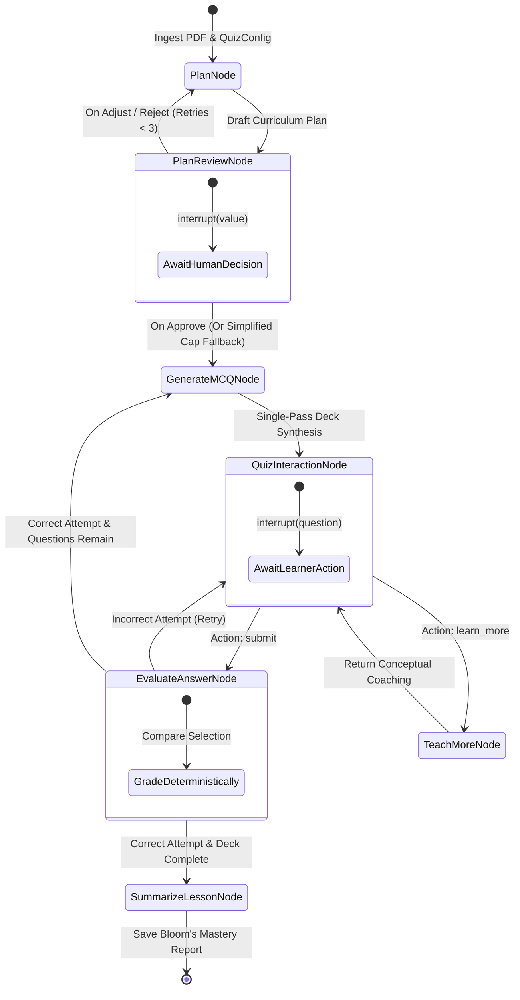

# Multi-Agent AI Pipeline and LangGraph Architecture

## 1. Pedagogical StateGraph Architecture

The entire assessment lifecycle is orchestrated via an asynchronous, cyclic **LangGraph 1.x** StateGraph:

---

## 2. Pipeline Stages and Node Specifications

### Stage 1: Plan Node (`plan_node`)
- **Role**: Educational curriculum architect.
- **Model**: `gemini-3.7-flash` with structured schema enforcement.
- **Objective**: Analyze the technical document and extract 3 to 5 core learning objectives. Deterministically allocate question budgets across objectives according to `total_questions` (clamped between 3 and 10).
- **Feedback Ingestion**: When triggered via the revision loop, incorporates previous feedback to alter topic weighting, adjust focus areas, or simplify objectives.

---

### Stage 2: Plan Review Node (`plan_review_node`)
- **Role**: Human-in-the-loop interruption barrier.
- **Mechanism**: Calls `interrupt({"plan": state["plan"], "revision": state["revision"]})` and pauses execution.
- **Resume Contract**: Receives a `Command(resume=...)` payload:
  - `approve`: Advances directly to `generate_mcq_node`.
  - `adjust`: Feeds customized user instructions into `plan_feedback` and routes back to `plan_node` (`revision += 1`).
  - `reject`: Flags restructuring request and routes back to `plan_node`.
- **Safety Fallback**: If `revision >= MAX_PLAN_REVISIONS` (3), automatically synthesizes a simplified 3-topic focus plan to prevent dead-ending.

---

### Stage 3: Generate MCQ Deck Node (`generate_mcq_node`)
- **Role**: Assessment deck synthesizer.
- **Model**: `gemini-3.7-flash` with JSON schema enforcement.
- **Optimization**: Generates the complete question deck in a single structured Gemini call.
- **Question Structure**:
  - `question_text`: Rigorous, scenario-based inquiry grounded in the source text.
  - `options`: 4 plausible, unambiguous choices.
  - `correct_letter`: Target answer (A, B, C, or D) stored in server-only state.
  - `explanation`: Comprehensive rationalization of why the answer is correct.
  - `hints`: Progressive multi-tier Socratic clues that guide reasoning without giving away the answer.

---

### Stage 4: Quiz Interaction Node (`quiz_interaction_node`)
- **Role**: Client interaction boundary.
- **Mechanism**: Calls `interrupt(...)` with the sanitized active question (`id`, `question_text`, `options`, `objective_title`, `hints`).
- **Security Barrier**: Strips `correct_letter` and answer metadata from the public payload before serialization.

---

### Stage 5: Evaluate Answer Node (`evaluate_answer_node`)
- **Role**: Zero-latency answer grader.
- **Mechanism**: Evaluates student selection against the server-side answer key in sub-millisecond memory without LLM invocation.
- **Branching**:
  - **Correct**: Marks objective milestone, records attempt telemetry, pops next question from `mcq_queue`, and transitions to the next item or summary.
  - **Incorrect**: Records attempt telemetry, provides contextual hints, and keeps question active for retry without penalty.

---

### Stage 6: Teach More Node (`teach_more_node`)
- **Role**: Socratic tutor and concept coach.
- **Model**: `gemini-3.7-flash` conditioned on source document context.
- **Objective**: Provides an in-depth, pedagogical walkthrough of the concept underlying the active question without revealing the correct option letter.

---

### Stage 7: Summarize Lesson Node (`summarize_lesson_node`)
- **Role**: Cognitive analytics and mastery assessor.
- **Model**: `gemini-3.7-flash`.
- **Objective**: Evaluates overall attempt telemetry and produces:
  - Overall performance score & mastery classification (Novice, Competent, Proficient, Master).
  - Objective-by-objective proficiency ratings mapped to Bloom's taxonomy cognitive levels.
  - Distinct strengths and growth opportunities.
  - Actionable follow-up reading and study recommendations.
