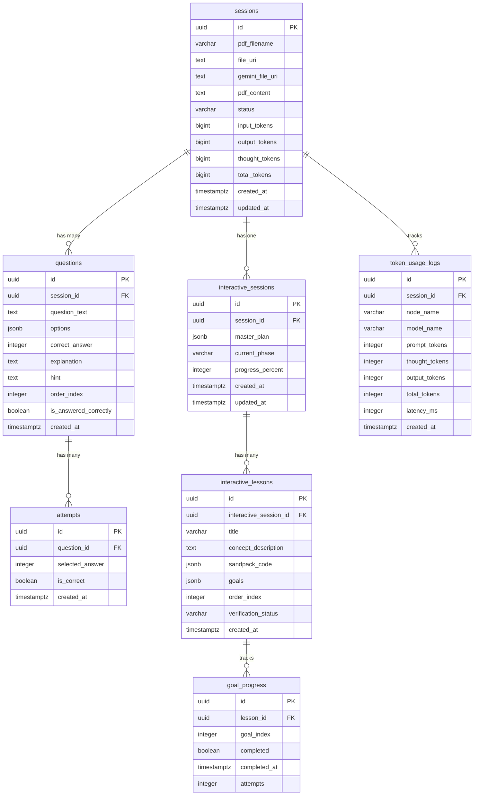

# 🗄️ SkillForge Database Schema & Data Dictionary

## 1. Entity-Relationship (ER) Diagram



---

## 2. Table Specifications & Data Dictionary

### Table 1: `sessions`
The root entity representing an uploaded document session.
| Column | Type | Constraints | Description |
| :--- | :--- | :--- | :--- |
| `id` | `UUID` | `PRIMARY KEY`, Default `gen_random_uuid()` | Unique session identifier. |
| `pdf_filename` | `VARCHAR(255)` | Nullable | Original uploaded file name. |
| `file_uri` | `TEXT` | Nullable | Supabase Storage public/signed URL. |
| `gemini_file_uri`| `TEXT` | Nullable | Active Google Gemini File API resource URI. |
| `pdf_content` | `TEXT` | Nullable | Extracted raw text fallback. |
| `status` | `VARCHAR(50)` | `NOT NULL`, Default `'uploading'` | Lifecycle: `'uploading'`, `'generating'`, `'active'`, `'failed'`. |
| `input_tokens` | `BIGINT` | `NOT NULL`, Default `0`, `CHECK >= 0` | Total prompt tokens consumed. |
| `thought_tokens`| `BIGINT`| `NOT NULL`, Default `0`, `CHECK >= 0` | Total Gemini 3.7 reasoning tokens. |
| `output_tokens`| `BIGINT` | `NOT NULL`, Default `0`, `CHECK >= 0` | Total generation candidate tokens. |
| `total_tokens` | `BIGINT` | `NOT NULL`, Default `0`, `CHECK >= 0` | Total tokens consumed. |
| `created_at` | `TIMESTAMPTZ`| `NOT NULL`, Default `NOW()` | Creation timestamp. |
| `updated_at` | `TIMESTAMPTZ`| `NOT NULL`, Default `NOW()` | Auto-updated via trigger. |

---

### Table 2: `questions`
Multiple-choice questions generated in standard assessment mode.
| Column | Type | Constraints | Description |
| :--- | :--- | :--- | :--- |
| `id` | `UUID` | `PRIMARY KEY` | Unique question identifier. |
| `session_id` | `UUID` | `FK -> sessions(id) ON DELETE CASCADE` | Parent session. *(Indexed: `idx_questions_session_id`)* |
| `question_text`| `TEXT` | `NOT NULL` | The question prompt text. |
| `options` | `JSONB` | `NOT NULL` | Array of 4 string options: `["A", "B", "C", "D"]`. |
| `correct_answer`| `INTEGER` | `NOT NULL`, Range `[0-3]` | Zero-based index of correct option. |
| `explanation` | `TEXT` | Nullable | Detailed educational explanation. |
| `hint` | `TEXT` | Nullable | Socratic guiding hint. |
| `order_index` | `INTEGER` | `NOT NULL` | Sequence order in quiz UI. |
| `is_answered_correctly` | `BOOLEAN` | `NOT NULL`, Default `FALSE` | Success flag for student attempt. |
| `created_at` | `TIMESTAMPTZ`| `NOT NULL`, Default `NOW()` | Creation timestamp. |

---

### Table 3: `attempts`
Student submission attempts per question.
| Column | Type | Constraints | Description |
| :--- | :--- | :--- | :--- |
| `id` | `UUID` | `PRIMARY KEY` | Unique attempt ID. |
| `question_id` | `UUID` | `FK -> questions(id) ON DELETE CASCADE` | Target question. *(Indexed: `idx_attempts_question_id`)* |
| `selected_answer` | `INTEGER` | `NOT NULL` | Option index chosen by student. |
| `is_correct` | `BOOLEAN` | `NOT NULL` | Whether selection was correct. |
| `created_at` | `TIMESTAMPTZ` | `NOT NULL`, Default `NOW()` | Attempt timestamp. |

---

### Table 4: `interactive_sessions`
Metadata and state tracking for the multi-lesson interactive simulation mode.
| Column | Type | Constraints | Description |
| :--- | :--- | :--- | :--- |
| `id` | `UUID` | `PRIMARY KEY` | Interactive session ID. |
| `session_id` | `UUID` | `FK -> sessions(id) ON DELETE CASCADE` | Parent base session. *(Indexed: `idx_interactive_sessions_session_id`)* |
| `master_plan` | `JSONB` | `NOT NULL`, Default `'[]'::jsonb` | Array of pedagogical simulation concept specs. |
| `current_phase`| `VARCHAR(50)` | `NOT NULL`, Default `'PENDING'` | Agent phase (`MASTER_PLANNING`, `CODE_GENERATION`, `COMPLETE`, etc.). |
| `progress_percent` | `INTEGER` | `NOT NULL`, Default `0`, Range `0-100` | UI progress bar percentage. |
| `created_at` | `TIMESTAMPTZ` | `NOT NULL`, Default `NOW()` | Creation timestamp. |
| `updated_at` | `TIMESTAMPTZ` | `NOT NULL`, Default `NOW()` | Auto-updated via trigger. |

---

### Table 5: `interactive_lessons`
Individual interactive simulation sandboxes generated by the Coder and Verifier nodes.
| Column | Type | Constraints | Description |
| :--- | :--- | :--- | :--- |
| `id` | `UUID` | `PRIMARY KEY` | Lesson ID. |
| `interactive_session_id` | `UUID` | `FK -> interactive_sessions(id) ON DELETE CASCADE` | Parent session. *(Indexed: `idx_interactive_lessons_interactive_session_id`)* |
| `title` | `VARCHAR(255)` | `NOT NULL` | Human-readable simulation title. |
| `concept_description` | `TEXT` | Nullable | Pedagogical concept explanation. |
| `sandpack_code` | `JSONB` | `NOT NULL` | Object containing `files: {"/App.js": "..."}`, `entryFile`, and `dependencies`. |
| `goals` | `JSONB` | `NOT NULL` | Array of actionable goal objects (`description`, `hint`, `validationType`). |
| `order_index` | `INTEGER` | `NOT NULL` | Sequence order in lesson carousel. |
| `verification_status` | `VARCHAR(20)` | `NOT NULL`, Default `'PENDING'` | AST verification state (`'VERIFIED'`, `'FAILED'`). |
| `created_at` | `TIMESTAMPTZ` | `NOT NULL`, Default `NOW()` | Creation timestamp. |

---

### Table 6: `goal_progress`
Real-time tracking of student completion for milestones inside each simulation.
| Column | Type | Constraints | Description |
| :--- | :--- | :--- | :--- |
| `id` | `UUID` | `PRIMARY KEY` | Unique record ID. |
| `lesson_id` | `UUID` | `FK -> interactive_lessons(id) ON DELETE CASCADE` | Target lesson. *(Indexed: `idx_goal_progress_lesson_id`)* |
| `goal_index` | `INTEGER` | `NOT NULL` | Zero-based index of the goal. |
| `completed` | `BOOLEAN` | `NOT NULL`, Default `FALSE` | Whether milestone is achieved. |
| `completed_at`| `TIMESTAMPTZ` | Nullable | First completion timestamp. |
| `attempts` | `INTEGER` | `NOT NULL`, Default `0` | Number of trigger dispatches. |

> [!IMPORTANT]
> **Composite Unique Constraint**: `UNIQUE (lesson_id, goal_index)` enables non-blocking atomic upserts via:
> ```sql
> INSERT INTO goal_progress (lesson_id, goal_index, completed, completed_at, attempts)
> VALUES ($1, $2, TRUE, NOW(), 1)
> ON CONFLICT (lesson_id, goal_index)
> DO UPDATE SET completed = TRUE, completed_at = NOW(), attempts = goal_progress.attempts + 1;
> ```

---

### Table 7: `token_usage_logs`
Fine-grained telemetry and auditing ledger for all AI model invocations.
| Column | Type | Constraints | Description |
| :--- | :--- | :--- | :--- |
| `id` | `UUID` | `PRIMARY KEY` | Log entry ID. |
| `session_id` | `UUID` | `FK -> sessions(id) ON DELETE CASCADE` | Associated session. *(Indexed: `idx_token_usage_session_id`)* |
| `node_name` | `VARCHAR(100)` | `NOT NULL` | Agent node (`master_planner`, `question_planner_0`, `coder_0`, etc.). |
| `model_name` | `VARCHAR(100)` | `NOT NULL` | Target Gemini model (`gemini-3.7-flash`). |
| `prompt_tokens` | `INTEGER` | `NOT NULL`, Default `0` | Input prompt tokens. |
| `thought_tokens`| `INTEGER` | `NOT NULL`, Default `0` | Gemini reasoning/thinking tokens. |
| `output_tokens` | `INTEGER` | `NOT NULL`, Default `0` | Output generation tokens. |
| `total_tokens` | `INTEGER` | `NOT NULL`, Default `0` | Total call tokens. |
| `latency_ms` | `INTEGER` | `NOT NULL`, Default `0` | Round-trip duration in milliseconds. |
| `created_at` | `TIMESTAMPTZ` | `NOT NULL`, Default `NOW()` | Timestamp of invocation. |
