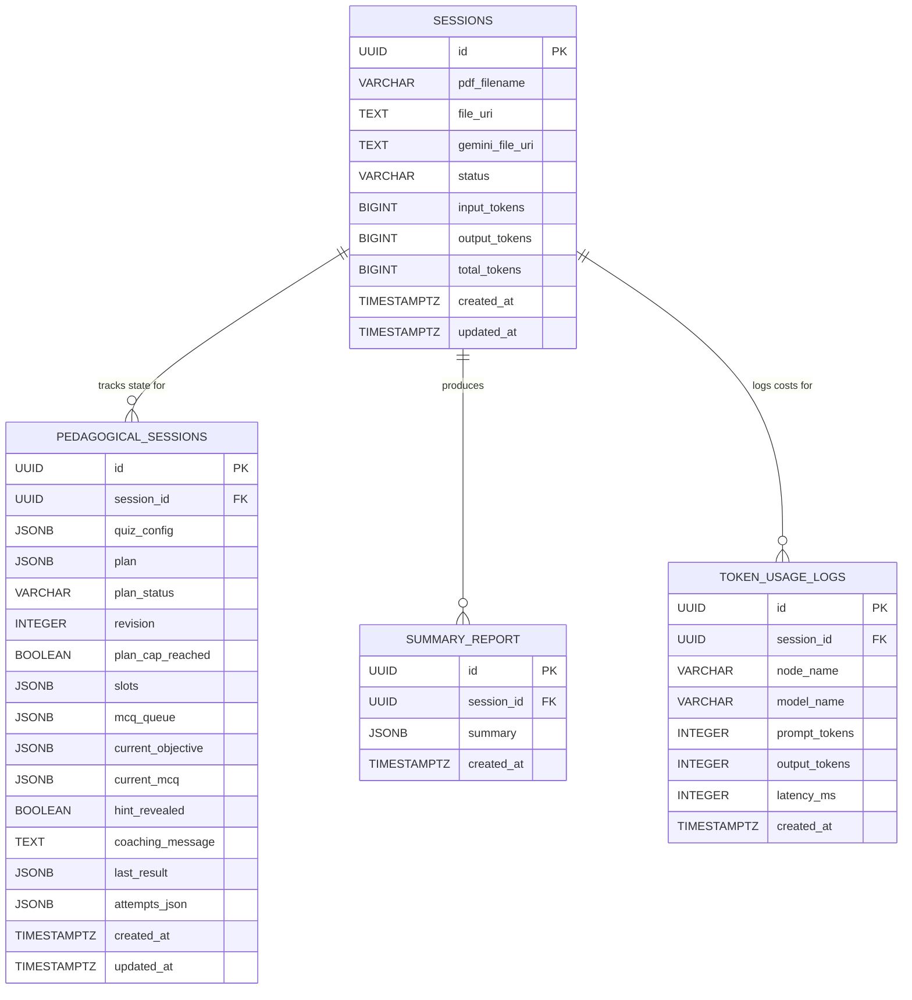

# QuizLoop Database Schema and Data Dictionary

## 1. Entity-Relationship (ER) Diagram

---

## 2. Table Specifications

### 1. `sessions` Table
The primary session ledger created upon document upload.

| Column | Type | Constraints | Description |
| :--- | :--- | :--- | :--- |
| `id` | `UUID` | `PRIMARY KEY` | Unique session identifier. |
| `pdf_filename` | `VARCHAR(255)` | `NULLABLE` | Original uploaded document name. |
| `file_uri` | `TEXT` | `NULLABLE` | Supabase storage bucket file path. |
| `gemini_file_uri` | `TEXT` | `NULLABLE` | Google Gemini File API URI. |
| `status` | `VARCHAR(50)` | `NOT NULL, DEFAULT 'uploading'` | Lifecycle status (`uploading`, `ready`, `failed`). |
| `input_tokens` | `BIGINT` | `NOT NULL, DEFAULT 0` | Total prompt tokens consumed. |
| `output_tokens` | `BIGINT` | `NOT NULL, DEFAULT 0` | Total completion tokens generated. |
| `total_tokens` | `BIGINT` | `NOT NULL, DEFAULT 0` | Cumulative token usage. |
| `created_at` | `TIMESTAMPTZ` | `NOT NULL, DEFAULT NOW()` | Ingestion timestamp. |
| `updated_at` | `TIMESTAMPTZ` | `NOT NULL, DEFAULT NOW()` | Last update timestamp. |

---

### 2. `pedagogical_sessions` Table
Maintains the server-side snapshot of the LangGraph state machine across interrupts.

| Column | Type | Constraints | Description |
| :--- | :--- | :--- | :--- |
| `id` | `UUID` | `PRIMARY KEY` | Record ID. |
| `session_id` | `UUID` | `NOT NULL, UNIQUE, FK -> sessions(id)` | Associated session ID. |
| `quiz_config` | `JSONB` | `NULLABLE` | Configuration parameters (`total_questions`, `difficulty`, `question_style`). |
| `plan` | `JSONB` | `NULLABLE` | Array of pedagogical objectives, concepts, and question budgets. |
| `plan_status` | `VARCHAR(50)` | `DEFAULT 'drafting'` | Status (`drafting`, `review`, `approved`, `completed`). |
| `revision` | `INTEGER` | `NOT NULL, DEFAULT 0` | Count of plan modification iterations. |
| `plan_cap_reached` | `BOOLEAN` | `NOT NULL, DEFAULT FALSE` | True if max revision cap (3) was triggered. |
| `slots` | `JSONB` | `NULLABLE` | Objective schedule slots with question assignments. |
| `mcq_queue` | `JSONB` | `NULLABLE` | Internal pre-generated question deck (including answer keys). |
| `current_objective` | `JSONB` | `NULLABLE` | Active learning objective. |
| `current_mcq` | `JSONB` | `NULLABLE` | Active question payload. |
| `hint_revealed` | `BOOLEAN` | `NOT NULL, DEFAULT FALSE` | Flag tracking if hint was requested. |
| `coaching_message` | `TEXT` | `NULLABLE` | Active conceptual coaching message. |
| `last_result` | `JSONB` | `NULLABLE` | Result payload from most recent answer attempt. |
| `attempts_json` | `JSONB` | `NULLABLE` | Historical log of all user question attempts and telemetry. |
| `created_at` | `TIMESTAMPTZ` | `NOT NULL, DEFAULT NOW()` | Creation timestamp. |
| `updated_at` | `TIMESTAMPTZ` | `NOT NULL, DEFAULT NOW()` | Timestamp of last state mutation. |

---

### 3. `summary_report` Table
Stores post-assessment mastery analytics and performance diagnostics.

| Column | Type | Constraints | Description |
| :--- | :--- | :--- | :--- |
| `id` | `UUID` | `PRIMARY KEY` | Report ID. |
| `session_id` | `UUID` | `NOT NULL, UNIQUE, FK -> sessions(id)` | Associated session ID. |
| `summary` | `JSONB` | `NOT NULL` | Comprehensive mastery payload (scores, Bloom's levels, strengths, growth areas, recommendations). |
| `created_at` | `TIMESTAMPTZ` | `NOT NULL, DEFAULT NOW()` | Report generation timestamp. |

---

### 4. `token_usage_logs` Table
Audit ledger tracking token expenditures per agent node execution.

| Column | Type | Constraints | Description |
| :--- | :--- | :--- | :--- |
| `id` | `UUID` | `PRIMARY KEY` | Log ID. |
| `session_id` | `UUID` | `NOT NULL, FK -> sessions(id)` | Associated session ID. |
| `node_name` | `VARCHAR(100)` | `NOT NULL` | Agent node name (`plan_node`, `generate_mcq_node`, `teach_more_node`, etc.). |
| `model_name` | `VARCHAR(100)` | `NOT NULL` | LLM model identifier (`gemini-3.7-flash`). |
| `prompt_tokens` | `INTEGER` | `NOT NULL, DEFAULT 0` | Input token count. |
| `output_tokens` | `INTEGER` | `NOT NULL, DEFAULT 0` | Generated token count. |
| `latency_ms` | `INTEGER` | `NOT NULL, DEFAULT 0` | Execution latency in milliseconds. |
| `created_at` | `TIMESTAMPTZ` | `NOT NULL, DEFAULT NOW()` | Timestamp. |
