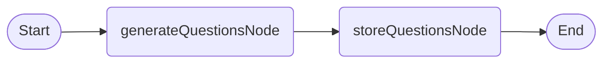
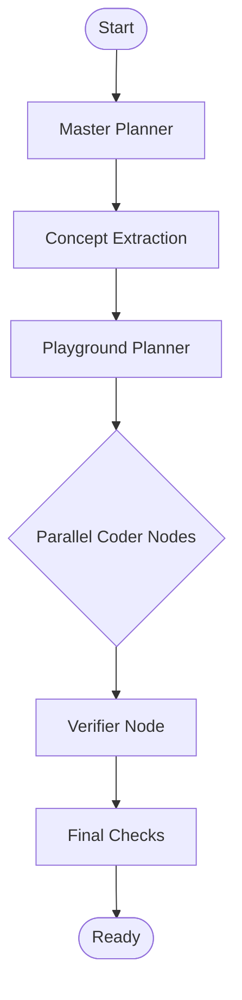

# Agent Implementation (LangGraph)

Memorang utilizes state-of-the-art multi-agent orchestration via LangGraph.js to drive its dual-mode learning engine.

## 1. Normal Mode Graph (MCQ)
A linear pipeline designed for speed and reliability.

## 2. Interactive Mode Graph (Simulation Playground)
A sophisticated 7-stage pipeline that leverages parallel generation and visual-first design.

### Node Details: Interactive Mode

| Node | Responsibility | Tech Detail |
|------|----------------|-------------|
| **Master Planner** | Analyzes the PDF to design a progressive curriculum path. | Gemini 1.5 Flash |
| **Concept Extraction**| Identifies "Interactables" (variables) and "Visuals" (feedback). | Gemini 1.5 Flash |
| **Playground Planner**| Defines the "Simulation API" (variable ranges, target values). | `Promise.all` for parallel planning |
| **Coder Node** | Generates absolute React code (Framer Motion + Lucide + Tailwind). | No-import pattern |
| **Verifier Node** | Performs sanity checks and ensures code conforms to the "Zero-Import" rule. | Regex + LLM Validation |
| **Final Checks** | Polishes the bundle and prepares persistence metadata. | Status Orchestration |

### Parallel Execution Strategy
To achieve high performance, the Interactive Graph employs **fan-out parallelism**. Once the Playground Planner has defined the lessons, individual Coder nodes are instantiated concurrently. This reduces total generation time significantly.

### Simulation Philosophy
Unlike traditional sandboxes, the Memorang Coder node is instructed to build a **Unified Dashboard**.
- **Sidebar-First**: Layout is split between a fixed configuration panel (Left) and a fluid visualization area (Right).
- **State-Driven**: Variables are managed in a central React state.
- **Physics-Aware**: The agent is prompted to include the necessary math/logic for realistic simulation behavior.
- **Goal Syncing**: The agent is explicitly instructed to call the global `completeGoal(index)` function from within its own UI controls (e.g., when a user completes a simulation task), ensuring the platform's milestone trackers are always in sync.
