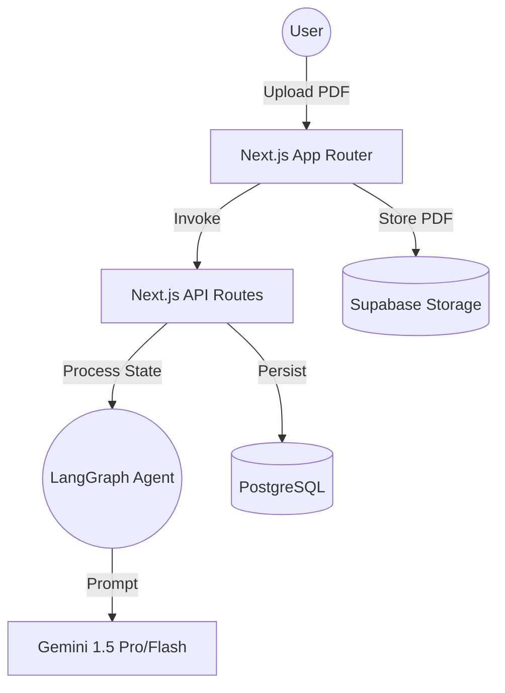

# Architecture Deep Dive

This document outlines the high-level and component-level architecture of the Memorang AI Learning Platform.

## System Overview

Memorang is built using a modern AI-native stack that prioritizes structured reasoning and persistent learning states.

## Infrastructure Layer

### 1. Database (PostgreSQL)
We use PostgreSQL to manage user sessions and quiz/sandbox progress.
- **Normal Mode**: `sessions`, `questions`, `attempts`.
- **Interactive Mode**: 
  - `interactive_sessions`: Linked to base session, tracks planning progress.
  - `interactive_lessons`: Stores curriculum, Sandpack code, and goal metadata.
  - `goal_progress`: Tracks student achievement for each exercise milestone.

### 2. Storage (Supabase)
PDF files are stored in a persistent `pdfs` bucket in Supabase for long-term reference and debugging.

### 2. Application Layer (Next.js 15)
The platform follows a highly modular, component-driven architecture:
- **Client Components**: Handle the complex lifecycle of PDF uploads, SSE connection management, and Sandpack hydration.
- **Server Actions/Routes**: Manage session persistence and direct integration with the LangGraph agent background workers.

### 3. AI Reasoning Core (LangGraph + Gemini)
The "Brain" of Memorang is a decentralized multi-agent system:
- **Parallelism**: Uses fan-out to generate a full 5-lesson simulation curriculum in parallel.
- **Simulation API**: The agent doesn't just write "code"; it designs a state-driven API for each visualization, separating `controls` logic from `view` logic.

### 4. Simulation Runtime (**Execution Pipeline**)
We use a **custom, ref-based mounting pattern** that eliminates the overhead and instability of iframes.
- **7-Step Execution Pipeline**: Our `LivePreview` component follows a robust lifecycle:
  1. **📄 Code Loading**: Retrieves AI-generated code.
  2. **🧹 Import/Export Removal**: Strips ESM statements for sandboxed execution.
  3. **⚙️ JSX/TS Transpilation**: Powered by **Sucrase** for blazing-fast in-browser transpilation.
  4. **🔧 Scope Injection**: Provides full access to `React`, `framer-motion`, and `LucideIcons`.
  5. **⚡ Execution**: Safe evaluation using `new Function()`.
  6. **🔍 Capture Validation**: Fallback logic to automatically detect `App` or `FallbackApp` if the AI forgets explicit `renderComponent` calls.
  7. **🎨 DOM Mounting**: Renders directly to a ref using a stable `ReactDOM.createRoot`. Unmounting is performed synchronously to prevent Strict Mode race conditions.
- **Debugging & Transparency**: Includes high-visibility debug panels and detailed console logging for every execution step.

## Performance Engineering
- **Streaming UI**: SSE allows users to stay engaged during the 15-20s generation window.
- **Optimistic Mastery**: Milestone completion is updated in the local React state immediately, with background synchronization to Supabase.

### LangGraph Orchestration
Memorang uses separate graphs for different modes:
1. **Normal Graph**: Generates MCQs directly from the Gemini File API.
2. **Interactive Graph**: A 4-stage multi-agent pipeline:
   - **Master Planner**: Analyzes PDF to design a progressive curriculum.
   - **Question Planner**: Breaks lessons into specific, achievable goals.
   - **Coder**: Generates working React code for the sandbox (executed in parallel).
   - **Verifier**: Performs syntactic validation using `@babel/parser`.

### Gemini Integration
We use the native `@google/genai` SDK with a **Dual-Authentication Strategy**:
- **Service Account (Priority)**: If `service-account.json` is present in the root, the system initializes with Google Application Default Credentials (ADC) for Vertex AI.
- **API Key (Fallback)**: If no service account is found, the system defaults to the `GEMINI_API_KEY` environment variable.
- **Model**: `gemini-3-flash-preview` provides high-speed, cost-effective reasoning.
- **Structured Outputs**: Extensive use of JSON response types for reliable parsing into DB schemas.

---

## Technical Performance Targets
- **TTF (Time to First Question)**: Aiming for < 8 seconds from PDF upload.
- **Mastery Consistency**: Ensuring 100% of questions are derived exclusively from the uploaded source.
