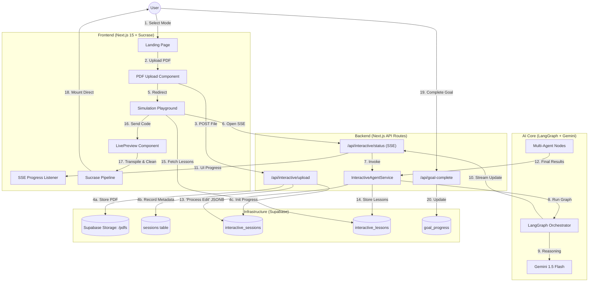
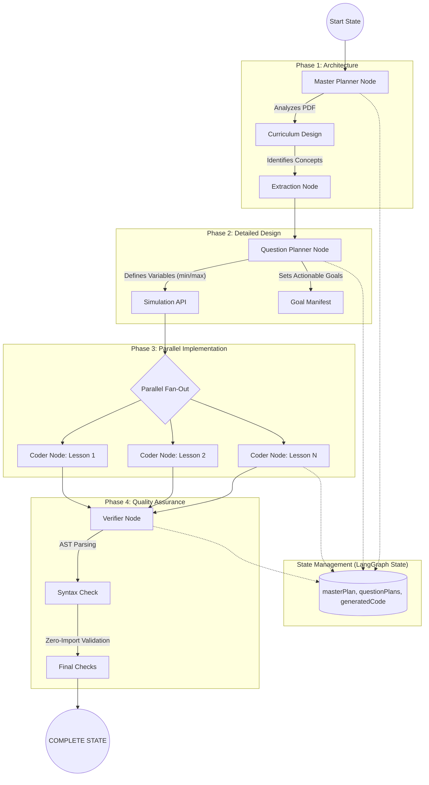

# Memorang Architecture & Multi-Agent Diagrams

This document provides two detailed architecture diagrams as requested: the overall system workflow and the internal multi-agent orchestration for interactive quizzes.

---

## 1. Overall System Architecture & Workflow

This diagram traces the journey of a user from landing on the platform to interacting with a fully generated, AI-powered simulation.

### 💡 Key Architectural Decisions

#### **The "Process Edit" (Why & How)**
*   **The "Why"**: Raw AI output is often "messy" (ESM imports, non-browser declarations). We have a **Process Edit** phase both in the Agent (to structure concepts) and in the Client (to sanitize code).
*   **The "How" (Supabase)**: We store the intermediate "Architectural Plans" in `interactive_sessions.master_plan` using **JSONB**. This allows the Coder nodes to work from a stable, pre-edited blueprint rather than raw PDF text.

#### **Supabase Integration**
*   **Storage**: PDFs are isolated in a secure bucket, referenced by public URLs in the DB.
*   **State Persistence**: We use Supabase as a persistent "Checkpointer". If a generation fails mid-way, the `current_phase` column tells us exactly where to resume.

---

## 2. Interactive Quiz Multi-Agent System

This diagram focuses on the **LangGraph** orchestration that powers the "Brain" of the Simulation Playground.

### 🔍 Agent Responsibilities

1.  **Master Planner**: Act as a "Pedagogical Architect". It maps the high-level flow (Curriculum) based on PDF complexity.
2.  **Question Planner**: Acts as a "Technical Lead". It translates abstract concepts into **Mathematical Variables** (e.g., Velocity: 0-100) and **Actionable Goals** (e.g., "Set X to > 50").
3.  **Coder Node**: Acts as a "Full-Stack Developer". It writes standalone React code using **Framer Motion** for physics and **Lucide** for UI. It follows the "No-Import" rule (dependencies are injected at runtime).
4.  **Verifier Node**: Acts as a "QA Engineer". It ensures the generated code won't crash the browser by performing a dry-run/syntax check before it ever hits the database.

---

## Technical Stack Summary

| Layer | Technology | Role |
| :--- | :--- | :--- |
| **Orchestration** | LangGraph.js | Multi-agent state machine & fan-out parallelism. |
| **Reasoning** | Gemini 1.5 Flash | High-speed, high-thinking level content generation. |
| **Database** | Supabase (PostgreSQL) | Persistence for sessions, plans, and mastery goals. |
| **Runtime** | Sucrase + ReactDOM | Direct, ref-based mounting of AI code (No iframes). |
| **Safety** | @babel/parser | Syntactic verification of generated simulations. |
